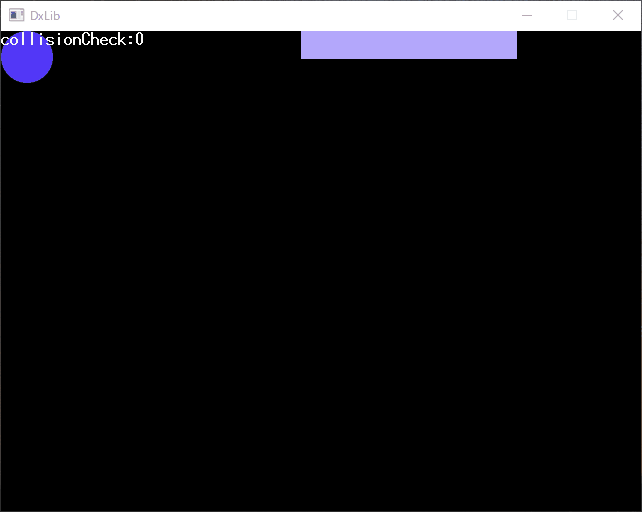

ブロック崩し(仮)
===
## 注意!
現在のバージョンは**prealpha4.1**です。開発途中であるため、機能がほとんど実装されていない上にバグが存在する可能性があります。
## 概要
WindowsPC上で動作するブロック崩しゲームです。  
アイテムや複雑なギミックは**一切**なく非常にシンプルなブロック崩しゲームとなっています。  
## 進捗

1. バー(上の画面の長方形の物体)を左矢印キーと右矢印キーを使って動かせるようにしました。
2. 前回のリリース(prealpha3.1)で仮実装だった当たり判定処理を実装しました。(二つの図形が重なったときだけcollisionCheck:1と表示されている)
## 実行に必要なもの
- WindowsXP以降のOS
- DirectX9以降がインストールされていること
## 実行方法
1. このリポジトリをダウンロード(もしくはクローン)します。
2. NewBreakingBlocks-ReleaseSoftwareの順にフォルダをたどっていくとNewBreakingBlocks.exeがあります。これを実行してください。
## ビルドに必要なもの
- Visual Studio Community 2017
- DXライブラリ Windows版 VisualC++用
    - DXライブラリが置かれているパスをメモしておくこと
## ビルドの方法
1. このリポジトリをクローンします
2. NewBreakingBlocksフォルダ内のあるNewBreakingBlocks.slnを開きます

DXライブラリが存在する場所は環境によって異なるため、再設定する必要があります。  

3. NewBreakingBlocksプロジェクトのプロパティを開きます。
4. 左側のリストから「構成プロパティ」-「C/C++」-「全般」を選択します
5. 右側に表示されている「追加のインクルードディレクトリ」の項目にあなたの環境での「プロジェクトに追加すべきファイル_VC版」フォルダのパスを入力して元の値と置き換えてください。
6. 続いて左側のリストから「構成プロパティ」-「リンカー」-「全般」を選択します
7. 右側に表示されている「追加のライブラリディレクトリ」の項目に手順5で設定した値を元の値と置き換えます
8. ダイアログの下のほうにあるOKを押してダイアログを押します。
9. メニューバーの下にあるテキストボックスに「Debug」「x86」と表示されていることを確認してください。されていない場合右の三角を押して変更してください。
10. Ctrl+Shift+Bを押してソリューション全体のビルドを実行します。
11. 最後にCtrl+F5を押して実行出来ることを確認してください。
## 本リポジトリのライセンス
このリポジトリには[MITライセンス](LICENSE)が適用されます。  
## DXライブラリライセンス
[こちら](DXLIBRARYLICENSE)に記載しています。